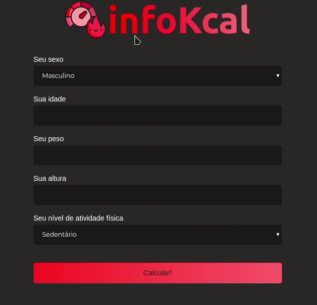

<h1 align="center">
  InfoKcal
</h1>

  

# Sobre

O projeto é uma calculadora de calorias que informa a taxa de metabolismo basal e a quantidade de calorias que o usuário deve consumir diariamente caso queira manter, perder ou ganhar peso.

## Instalação

1. Esse projeto não precisa de nenhuma dependência para funcionar
2. Clone o repositório ` git clone https://github.com/pleonardodp12/infoKcal.git`

